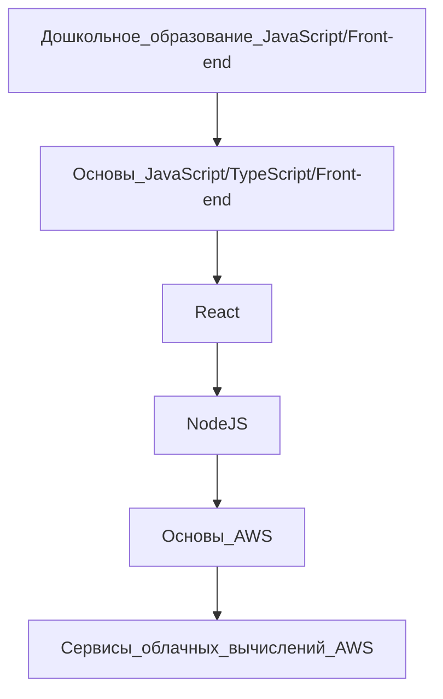

## Обо мне -

<!-- TO DO: выучиться на веб-программиста -->

Привет, меня зовут Максим.

🌱 Сейчас я изучаю веб-программирование в RS School.

---
> Наша суть отражается в наших повторяющихся действиях. Отсюда следует, что совершенство есть не действие, а привычка.

— Аристотель

<details open>
<summary>Мои языки</summary>
    
| Ранг | Язык       |
|-----:|------------|
|     1| HTML       |
|     2| CSS        |
|     3| JavaScript |

</details>

Этапы обучения:


Рассматриваемый город для работы после завершения обучения:
```topojson
{
  "type": "Topology",
  "transform": {
    "scale": [0.0005000500050005, 0.00010001000100010001],
    "translate": [100, 0]
  },
  "objects": {
    "example": {
      "type": "GeometryCollection",
      "geometries": [
        {
          "type": "Point",
          "properties": {"prop0": "value0"},
          "coordinates": [4000, 5000]
        },
        {
          "type": "LineString",
          "properties": {"prop0": "value0", "prop1": 0},
          "arcs": [0]
        },
        {
          "type": "Polygon",
          "properties": {"prop0": "value0",
            "prop1": {"this": "that"}
          },
          "arcs": [[1]]
        }
      ]
    }
  },
  "arcs": [[[4000, 0], [1999, 9999], [2000, -9999], [2000, 9999]],[[0, 0], [0, 9999], [2000, 0], [0, -9999], [-2000, 0]]]
}
```

<picture>
    <source media="(prefers-color-scheme: dark)" srcset="https://images.ctfassets.net/12phxmr4hjo6/54xZKTFT8faJLvOBIj6uTS/c1fa7d8a7f4c664b399f651e336145f7/rs-slope-angular.webp">
    <source media="(prefers-color-scheme: light)" srcset="https://images.ctfassets.net/12phxmr4hjo6/1PQNZCgCtjBwfFS7C4X6R2/4cfd540f2f719fd8d8973325e6a377f9/rs-slope-js.webp">
    
</picture>

**webdevelopedu/webdevelopedu** это репозиторий для ✨ _обучения_ ✨ в RS School.
